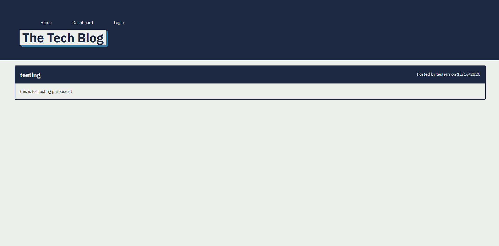
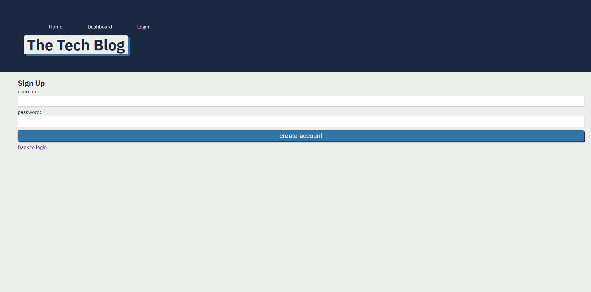

# The Tech Blog 
---
A CMS-style blog site that allows the user to create blog posts and comment on other user posts. The user can also edit and delete their posts. 

    
## Installation
---
Run `npm i` to install the required packages.

 Create an .env file to create the necessary database 
 information such as 
* DB_USER = ''
* DB_PW = ''
* MYSQL_HOST = ''
* MYSQL_PORT = ''
* DB_NAME = ''
* NODE_ENV = ''

## Usage
---
1. The user must first run the schema.sql file on their MySQL server to create the tech-blog database. 
2. The user can then start the server using Node.
3. Then go to http://localhost:3001 in browser to test the site.

    

4. In order to create posts, the user must login on the Login page or create an account on the Sign Up page

    

## Resources
---
* [MySQLWorkbench](https://www.mysql.com/products/workbench/) - Visual database design tool

### Dependencies
---
* [Node.js](https://nodejs.org/en/) - JavaScript runtime environment
* [mysql2](https://www.npmjs.com/package/mysql2) - Used to connect to the MySQL database and perform queries
* [Express](https://www.npmjs.com/package/express) - For routing.
* [Sequelize](https://www.npmjs.com/package/sequelize) - Sequelize is a promise-based Node.js ORM for Postgres, MySQL, MariaDB, SQLite and Microsoft SQL Serve
* [Handlebars](https://handlebarsjs.com/) Formatting.

## Links
---
[Deployedsite]https://techblog98.herokuapp.com/

